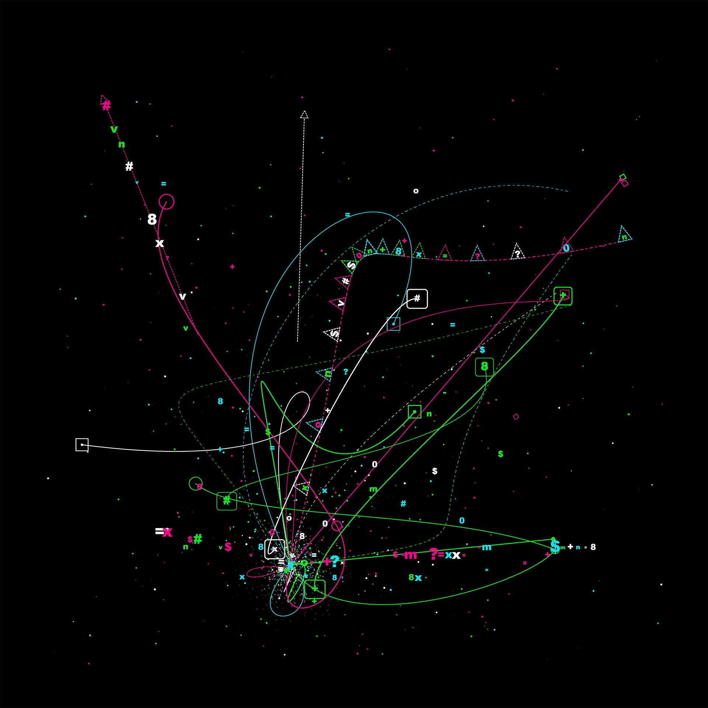

# Ollama Development Toolkit



## Overview

This is a comprehensive development and testing toolkit for working with Ollama language models. The project provides tools for analyzing, simulating, and testing LLM behavior with advanced prompt engineering and response processing capabilities.

## Key Features

- **Advanced LLM Analysis** - Deep analysis of model responses and behavior patterns
- **Response Processing Engine** - Sophisticated engine for processing and analyzing LLM outputs 
- **Prompt Engineering Tools** - Dynamic prompt generation using randomized linguistic features
- **Model Configuration Management** - Fine-tuned parameter control for optimal model performance
- **Simulation Framework** - Framework for running controlled LLM experiments and scenarios
- **Rich Logging & Monitoring** - Comprehensive logging with color-coded output and detailed metrics

## Architecture

- **`analyze.py`** - Main analysis engine for processing LLM responses and extracting insights
- **`sim.py`** - Simulation framework for running controlled LLM experiments  
- **`config.py`** - Model configuration and parameter management
- **`instructions.py`** - System prompts and instruction templates
- **`langfeatures.py`** - Language feature categorization for dynamic text generation
- **`jam.py`** - Audio/frequency processing utilities
- **Supporting utilities** - HTTP testing, model updates, and various helper scripts

## Quick Start

### Prerequisites
- Python 3.8+
- Ollama installed and running
- Redis server (optional, for advanced features)

### Installation
```bash
git clone https://github.com/kilitary/ollama-dev.git
cd ollama-dev
pip install -r requirements.txt
```

### Basic Usage
```bash
# Run main analysis
python analyze.py

# Run simulation experiments
python sim.py

# Test HTTP endpoints
python httptest.py
```

## Documentation

- [Engine Results Documentation](docs/engine-results.md) - Understanding LLM output processing
- [Algorithm Reference](docs/algorithms.md) - Sampling techniques and methods used
- [Configuration Guide](docs/configuration.md) - Model parameters and settings

## License

Copyright (c) 2024-2025 kilitary@gmail.com